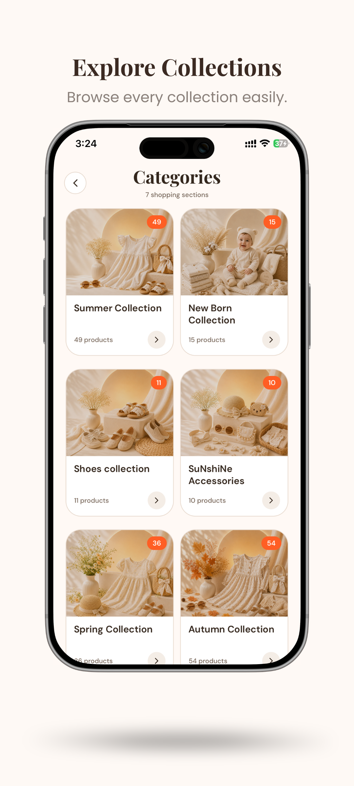
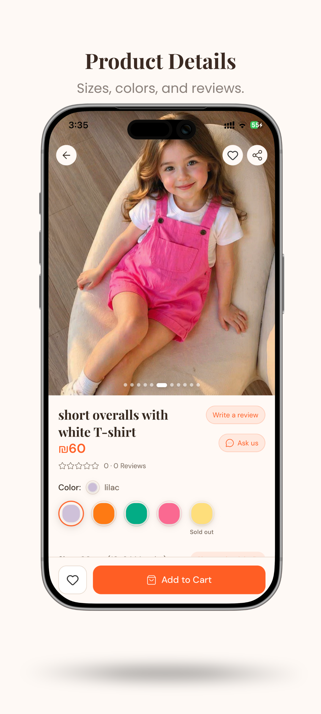
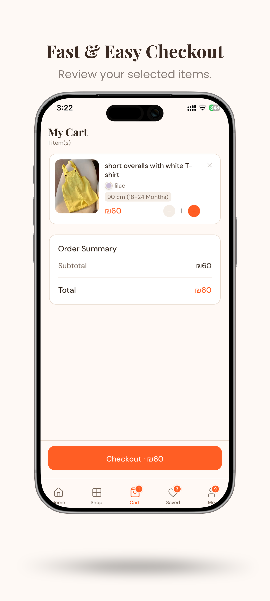
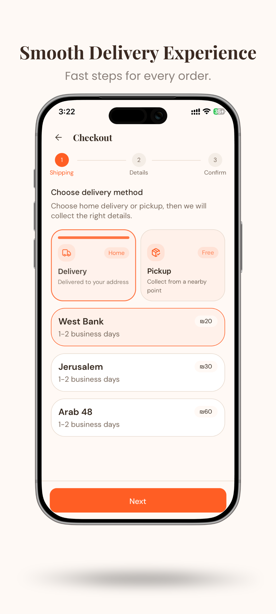
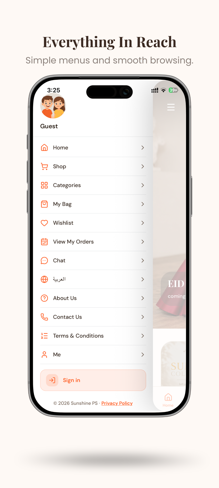
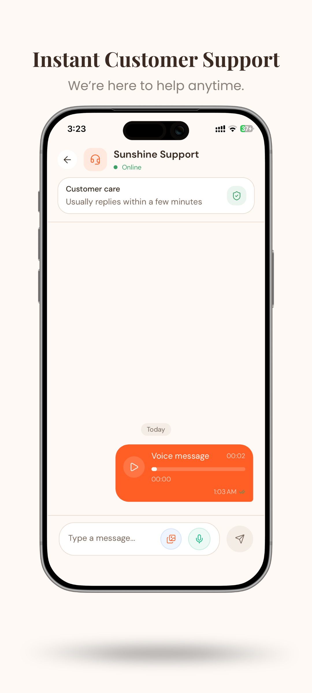
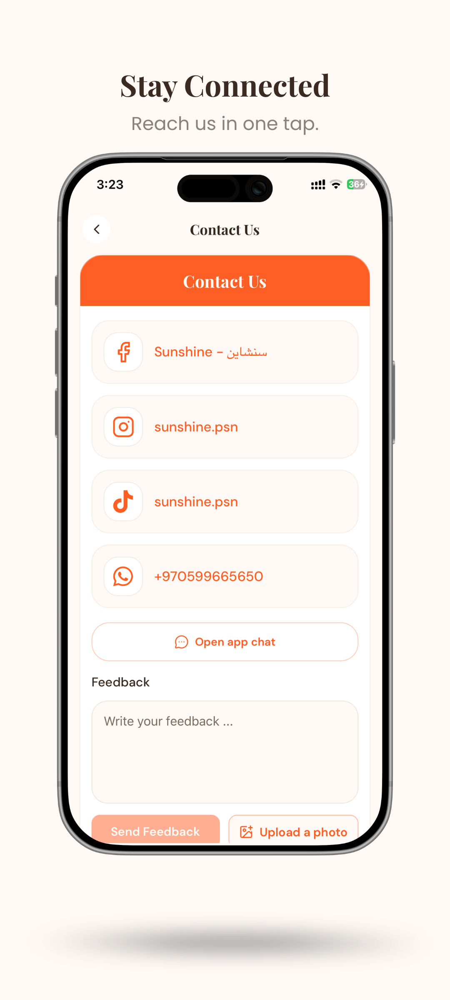

# Sunshine PS

Modern Fashion E-Commerce Platform for **Android**, **iOS**, and **Web**.

> ⚠️ This repository is a **case study and portfolio showcase only**.  
> The production source code is proprietary and remains private.

---

# Overview

Sunshine PS is a full-featured fashion e-commerce platform built to deliver a premium shopping experience across mobile and web.

The platform includes customer applications, an administration dashboard, cloud backend services, and a complete order management workflow.

---

# Key Features

- Cross-platform mobile application (Android & iOS)
- Responsive web application
- Secure user authentication
- Product catalog & categories
- Product search & filtering
- Shopping cart
- Wishlist
- Checkout & order management
- Customer chat
- Push notifications
- Admin dashboard
- Inventory & product management
- Firebase cloud backend
- Optimized UI/UX
- Reusable component architecture

---

# Screenshots

## Home

---

## Shop

---

## Categories

---

## Product Page

---

## Wishlist

---

## Cart

---

## Checkout

---

## Menu

---

## Chat

---

## Contact Us

---

# Tech Stack

- React Native
- Expo
- React
- TypeScript
- Firebase
- Firestore
- Firebase Authentication
- Firebase Storage
- Cloud Functions
- REST APIs

---

# Platforms

- Android
- iOS
- Web

---

# Project Highlights

- Built and maintained a production-ready cross-platform application.
- Designed scalable Firebase architecture.
- Developed responsive web interfaces using React and TypeScript.
- Implemented reusable UI components.
- Optimized application performance and user experience.
- Managed complete e-commerce workflows from authentication to checkout.

---

# Live Application

### Website

https://sunshine.ps

### Google Play

https://play.google.com/store/apps/details?id=com.sunshine.kareemdiab

### Apple App Store

https://apps.apple.com/jo/app/sunshine-ps/id6746424637

---

# Note

This repository is intended to showcase the project and its functionality.

The complete production source code, backend implementation, infrastructure, and business logic are not included for intellectual property protection.

---

© Sunshine PS
